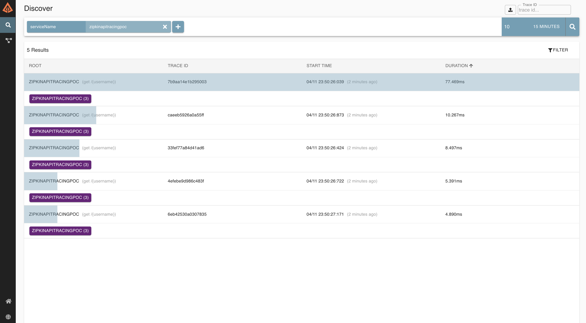
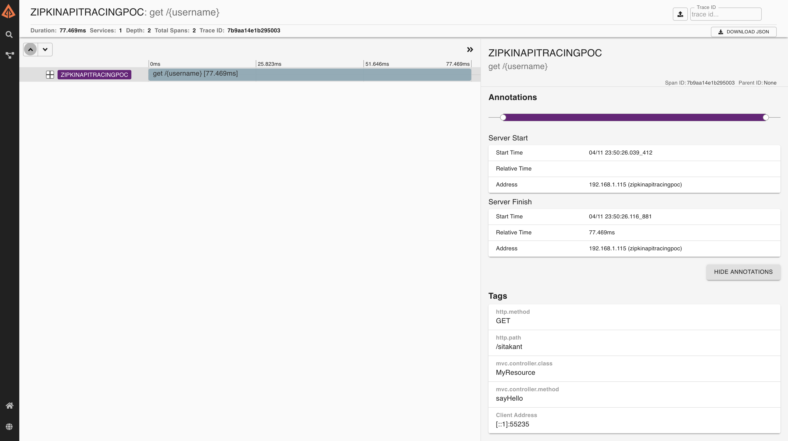

# ZipkinAPITracingPOC

This application is to trace the api 

## Pre-Req
- Zipkin server is a mandatory to be installed using Spirng boot or a docker 
[Zipkin Details](https://zipkin.io/pages/quickstart.html)

Below is the docker command to install zipkin server
```jshelllanguage
docker run -d -p 9411:9411 openzipkin/zipkin
```

For more on this. [Click Here](https://hub.docker.com/r/openzipkin/zipkin/)

Trace Details : 
- 
- 
